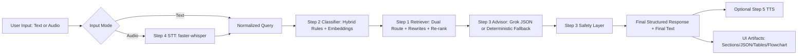

# Veridiction End-to-End Pipeline: Detailed Technical Documentation

## 1. Purpose of this document

This document explains the full Veridiction runtime pipeline from first user interaction (text or voice) to final synthesized answer. It is based on the current implementation in the repository and is written as an engineering + AI/NLP trace.

Coverage includes:
- Exact sequence of processing stages
- Tech stack at each stage and why each component is used
- GenAI/NLP concepts used in each stage
- Output schema and end-result behavior
- Safety, grounding, and fallback behaviors

---

## 2. Entry points and runtime modes

### 2.1 User-facing entry points

The system can be launched from:
- Streamlit app: app_streamlit.py
- Gradio app: app_gradio.py
- CLI orchestrator: agents/langgraph_flow.py

### 2.2 Input modes

The user can provide:
1. Text query directly
2. Audio input from microphone/upload

Mode decision logic:
- Text mode: use typed query as-is
- Audio mode: run speech-to-text first, then pass transcript to legal pipeline
- Auto mode: if audio exists, audio path is preferred

---

## 3. High-level architecture

Pipeline orchestrator:
- LangGraph state machine in agents/langgraph_flow.py
- Node order: retriever -> advisor -> safety

---

## 4. Step-by-step deep technical flow

## 4.1 Step 0: Input capture and normalization

### What happens
- UI collects text, audio, or both.
- Input mode resolver decides whether transcription is needed.
- Empty-input guards prevent invalid pipeline execution.

### Tech stack used
- Streamlit/Gradio for interaction and rendering.
- Python service-layer caches for heavy objects (graph, transcriber, TTS engine).

### Why this is used
- Keeps UX responsive while avoiding repeated expensive model initialization.
- Supports both accessibility-first voice UX and traditional text UX.

### NLP/GenAI concept
- This stage is pre-NLP orchestration and modality routing.
- Key concept: multimodal entry normalization into one text representation for downstream NLP.

---

## 4.2 Step 4: Speech-to-text (only when input is audio)

Implementation module:
- audio/transcriber.py

### What happens
1. Audio is captured from file or microphone (fixed duration or live mode).
2. Audio is converted to WAV-compatible frames when recorded live.
3. faster-whisper transcribes audio into segments.
4. Segment texts are merged into final transcript.
5. Metadata is produced: language, language_probability, duration, segment-level confidence signals.

### Tech stack used and why
- faster-whisper (WhisperModel):
  - Used for robust multilingual ASR with practical speed/accuracy tradeoff.
  - Distilled large model variant gives strong quality while reducing runtime cost.
- Model default:
  - distil-large-v3 (HF path points to Systran/faster-distil-whisper-large-v3 cache).
- Torch runtime:
  - CUDA path uses float16 for speed on GPU.
  - CPU path uses int8 for lower memory and broader compatibility.
- sounddevice + numpy + wave:
  - Real-time microphone stream capture and PCM16 WAV writing.

### GenAI/NLP concepts used
- Transformer ASR encoder-decoder behavior (Whisper family).
- Beam search decoding (beam_size=5 by default).
- Voice activity detection filtering (vad_filter=True) to suppress non-speech segments.
- Language identification probability output.

### Notes on "morphing"
- There is no linguistic morphology engine (stemming/lemmatization pipeline) in STT.
- "Morphing-like" processing here refers to signal normalization and segment aggregation, not token morphology.

---

## 4.3 Step 2: Legal claim classification and urgency detection

Implementation module:
- nlp/classifier.py

### What happens
1. Query text is evaluated by two parallel signals:
   - Rule-based keyword pattern scoring
   - Embedding similarity against claim prototypes
2. Scores are fused with weighted hybrid logic.
3. Primary claim type is selected; secondary claim types may be added.
4. Urgency level is detected.
5. Intent dimensions are scored and labeled.

### Supported claim classes
- unpaid_wages
- domestic_violence
- property_dispute
- wrongful_termination
- police_harassment
- tenant_rights
- consumer_fraud
- other

### Tech stack used and why
- sentence-transformers/all-MiniLM-L6-v2:
  - Compact, fast sentence encoder for semantic classification.
  - Good latency for local inference.
- Cosine similarity on normalized embeddings:
  - Stable semantic matching to prototype descriptions.
- Regex/rule system:
  - Deterministic legal keyword detection, useful for controllability and explainability.

### Hybrid scoring equation
The classifier combines rule and semantic signals as:

$$
\text{combined}(label) = 0.35 \cdot \text{keyword}(label) + 0.65 \cdot \text{embedding}(label)
$$

Confidence threshold behavior:
- If best score < min_confidence (default 0.33), fallback class is other.

### Additional override logic
- Paid-resolution override for unpaid_wages false positives.
- Child-labor sensitive override to avoid simplistic unpaid_wages assignment.
- Urgency elevation for danger/violence/police signals.

### GenAI/NLP concepts used
- Dense semantic encoding (sentence embedding).
- Prototype-based zero/few-shot style classification.
- Lexical-rules + semantic fusion (hybrid NLP).
- Multi-intent tagging (procedural, evidence, forum, timeline, relief).

---

## 4.4 Step 1: Retrieval (RAG core) with dual-route strategy

Implementation module:
- rag/retriever.py

### What happens
1. Retriever loads or builds vector index over judgment datasets.
2. Procedural corpus is loaded in streaming/in-memory mode.
3. Query intent routing chooses retrieval emphasis:
   - procedural_priority (for procedural questions)
   - judgment_priority (default)
4. Query rewrite generation creates expanded variants.
5. Retrieval runs across one or both routes.
6. Advanced reranking and score calibration applied.
7. Top-k merged passages returned with metadata.

### Data sources used
Judgment datasets:
- vihaannnn/Indian-Supreme-Court-Judgements-Chunked
- Subimal10/indian-legal-data-cleaned

Procedural datasets:
- viber1/indian-law-dataset
- ShreyasP123/Legal-Dataset-for-india
- nisaar/Lawyer_GPT_India

### Tech stack used and why
- LlamaIndex VectorStoreIndex:
  - Persistent local vector index for dense retrieval.
- HuggingFaceEmbedding (all-MiniLM-L6-v2):
  - Fast, local embedding backend aligned with classifier model family.
- datasets (HF Datasets):
  - Unified dataset loading + streaming support.

### Retrieval mechanics in detail

#### A) Intent-based route selection
- Procedural intent keywords trigger procedural-first retrieval.
- Otherwise, retrieval is judgment-first with procedural fallback.

#### B) Query rewriting
Query variants add targeted legal framing, for example:
- Filing/forum/documents in Maharashtra for procedural intent.
- Precedent/remedy framing for substantive intent.

#### C) Candidate expansion
- Dense retriever pulls 5x candidate pool before final rerank.

#### D) Advanced lexical-semantic rerank
Three boosting layers are applied:
1. Phrase boost (highest)
2. TF-IDF weighted keyword boost
3. Legal synonym boost

TF-IDF formula used:

$$
\text{IDF}(w)=\log\left(\frac{N}{1+df(w)}\right)
$$

Where:
- $N$ is total document count
- $df(w)$ is count of documents containing token $w$

#### E) Diversity reranking
- Removes near-duplicate passages.
- Controls source dominance per index type.

#### F) Score calibration
- Final scores are linearly mapped to 0.80-0.95 band for quality consistency in top outputs.

### GenAI/NLP concepts used
- Dense retrieval over vector embeddings.
- Hybrid reranking (semantic + lexical + domain synonyms).
- Query expansion/rewrite for recall improvement.
- Multi-corpus route-aware retrieval.

---

## 4.5 Step 3A: Structured advisor generation

Implementation module:
- agents/langgraph_flow.py (StructuredAdvisor + GrokClient)

### What happens
1. Claim profile + retrieved passages + legal mappings are assembled.
2. Grounding quality is estimated from top retrieval score.
3. Advisor generation path is selected:
   - Preferred: Grok API structured JSON generation
   - Fallback: deterministic template-based response generation
4. Output is validated through Pydantic schema.

### Provider behavior
- Grok path enabled when API key exists and provider mode allows it.
- Low-grounding mode is activated when passage confidence is weak (top score < 0.84).
- If provider fails or is disabled, deterministic fallback is always available.

### Tech stack used and why
- Grok chat-completions endpoint:
  - Generates rich structured legal guidance from evidence + mapping.
- Pydantic models:
  - Enforces strict schema consistency for all sections.
- Local LegalKnowledgeBase JSON:
  - Injects Maharashtra forum/process/documents and India helplines.

### Output schema sections (structured)
- case_scenario
- possible_steps
- required_documentation
- courts_and_filing_process
- severity_assessment
- helplines_india
- flowchart
- tts_summary

### GenAI/NLP concepts used
- Grounded generation (retrieval-augmented generation).
- Structured JSON generation under schema constraints.
- Controlled fallback generation for deterministic reliability.

---

## 4.6 Step 3B: Safety layer and risk escalation

Implementation module:
- agents/langgraph_flow.py (safety_node)

### What happens
1. Risk flags are computed from query + claim profile.
2. Safe immediate actions are assembled (including emergency/helpline guidance).
3. Severity can be upgraded (for example to critical on immediate danger).
4. Mandatory disclaimer is injected.

### Risk flags examples
- immediate_danger
- domestic_violence_risk
- police_misconduct
- high_urgency
- limited_grounding

### Why this is used
- Prevents purely procedural advice when user safety risk is present.
- Adds triage-aware emergency prioritization before legal workflow details.

### GenAI/NLP concepts used
- Safety policy layer over generated/legal outputs.
- Rule-driven risk detection integrated with semantic pipeline state.

---

## 4.7 Final response synthesis and serialization

Implementation modules:
- agents/langgraph_flow.py (final_response)
- app_streamlit.py and app_gradio.py (UI-facing formatting)

### What happens
- Final response object is composed by merging:
  - Classification outputs
  - Retrieval outputs and citations
  - Structured legal sections
  - Safety object
  - TTS summary and final_text
  - Node-level and total latency metrics

- Additional explainability fields are generated:
  - missing_facts_followups
  - section_citations
  - retrieval_route and retrieval_query_variants

### Why this is used
- Produces one canonical machine-readable output plus human-readable sectioned text.
- Enables downstream UI rendering, auditability, and debugging.

---

## 4.8 Step 5: Text-to-speech synthesis (optional)

Implementation module:
- tts/speak.py

### What happens
1. Spoken text is chosen (tts_summary preferred over full final_text).
2. Text normalization runs:
   - remove markdown/code fences
   - remove control characters
   - collapse whitespace
   - enforce max length
3. TTS engine selection:
   - Primary: edge-tts (online neural voice)
   - Fallback: pyttsx3 (offline local voice)
4. Audio artifact metadata returned.

### Tech stack used and why
- edge-tts:
  - Higher quality neural voice with good intelligibility.
- pyttsx3 fallback:
  - Ensures offline robustness and no hard dependency on network.

Default voice:
- en-IN-NeerjaNeural (India-centric English voice)

### GenAI/NLP concepts used
- Neural TTS synthesis.
- Controlled speech summarization via concise tts_summary to improve listening usability.

---

## 5. End output: structure and behavior

The pipeline returns a rich response object with these major groups:

1. Input and mode
- input_mode
- transcript
- audio_metadata (if audio path)

2. Classification
- claim_type
- secondary_claim_types
- hybrid_claim_types
- urgency
- confidence
- intent_labels
- intent_scores

3. Retrieval and grounding
- retrieval_route
- retrieval_query_variants
- retrieved_passages (score + metadata)
- section_citations

4. Advisory synthesis
- structured_response (all major legal sections)
- missing_facts_followups
- tts_summary
- final_text

5. Safety
- safety.risk_flags
- safety.safe_next_steps
- safety.disclaimer

6. Operational telemetry
- node_latencies_ms
- total_pipeline_ms

### Explainability characteristics
- Passage-level evidence is surfaced with source metadata.
- Section-specific citations are provided.
- Follow-up questions explicitly call out missing facts.
- Retrieval route and rewrites are exposed for auditability.

### Safety characteristics
- Emergency risk can override and escalate severity.
- Disclaimer is always appended.
- "Limited grounding" is explicitly flagged when evidence is weak.

---

## 6. Detailed technology map by pipeline stage

| Stage | File(s) | Technology | Why this technology |
|---|---|---|---|
| Input/UI | app_streamlit.py, app_gradio.py | Streamlit, Gradio | Fast prototyping and rich debugging outputs |
| Audio capture | audio/transcriber.py | sounddevice, numpy, wave | Real-time microphone capture and WAV encoding |
| ASR | audio/transcriber.py | faster-whisper, torch | High-quality local transcription with GPU/CPU adaptability |
| Classification | nlp/classifier.py | sentence-transformers, regex rules | Semantic robustness + deterministic control |
| Dense retrieval | rag/retriever.py | LlamaIndex, HuggingFaceEmbedding | Persistent vector retrieval over legal corpus |
| Dataset layer | rag/retriever.py | Hugging Face datasets | Multi-dataset loading and streaming |
| Reranking | rag/retriever.py | TF-IDF + phrase + synonym boosts | Better legal relevance and precision |
| Orchestration | agents/langgraph_flow.py | LangGraph | Deterministic node sequencing and state passing |
| Structured generation | agents/langgraph_flow.py | Grok API + Pydantic | Schema-constrained legal guidance |
| Deterministic fallback | agents/langgraph_flow.py | Rule/template logic | Reliability when API unavailable |
| Safety policy | agents/langgraph_flow.py | Risk-rule layer | Emergency-aware and compliance-aware behavior |
| TTS | tts/speak.py | edge-tts + pyttsx3 | Online quality with offline fallback robustness |

---

## 7. Important implementation choices and rationale

1. Hybrid classifier instead of pure LLM classification
- Improves determinism and speed.
- Keeps behavior explainable for legal triage.

2. Dual retrieval route (judgment + procedural)
- Judgment text helps legal grounding.
- Procedural corpus helps practical next-step guidance.

3. Query rewrite + reranking
- Raises recall and relevance in sparse legal language scenarios.

4. Structured output schema
- Prevents free-form, hard-to-validate legal response drift.

5. Safety node as final mandatory stage
- Ensures emergency escalation cannot be skipped by generator behavior.

6. Multi-layer fallback strategy
- Advisor fallback (no API), TTS fallback (offline), route fallback (procedural probe).
- Designed for resilience in constrained environments.

---

## 8. What the user finally experiences

From user perspective, the final answer includes:
1. A clear case scenario summary.
2. Prioritized immediate and legal action steps.
3. Required document checklist.
4. Court/forum and filing path guidance for Maharashtra context.
5. Severity level and urgency explanation.
6. India helplines and emergency next steps if risk is detected.
7. Optional spoken summary audio.
8. Evidence-backed retrieval context for transparency.

This makes the output actionable, safety-aware, and auditable, instead of only being a generic chatbot paragraph.

---

## 9. Current limitations and practical notes

1. Jurisdiction specialization
- Knowledge mapping is Maharashtra-focused, though corpus is broader Indian legal material.

2. Score calibration policy
- Retrieval scores are calibrated to a fixed high band for ranking consistency; treat as relative confidence, not legal certainty.

3. STT language setting
- Pipeline defaults to English language path in current configuration.

4. Legal advisory boundary
- The system is explicit triage/support, not legal representation.

---

## 10. Conclusion

Veridiction is implemented as a robust legal triage pipeline with:
- Multimodal intake (text/audio)
- Hybrid NLP classification
- Advanced dual-route RAG retrieval
- Schema-constrained grounded advisory generation
- Mandatory safety escalation
- Optional speech synthesis and rich explainability artifacts

Architecturally, it is designed to be practical and resilient: high interpretability, clear fallback behavior, and explicit risk handling for real-world legal assistance workflows.
