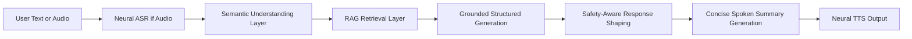

# Veridiction: Generative AI Concepts Applied (Detailed Documentation)

## 1. Purpose

This document explains the project strictly from the Generative AI perspective: which GenAI concepts are applied, where they are used in the pipeline, and why they are necessary in a legal-assistant system.

It focuses on applied concepts, not UI engineering or general software architecture.

---

## 2. GenAI-first pipeline view

This pipeline combines retrieval + generation + safety controls so the model output remains useful, structured, and risk-aware.

---

## 3. Concept 1: Neural Speech Recognition as Generative Sequence Modeling

## What it is
Audio transcription is performed by a transformer ASR model that generates text tokens from acoustic input.

## Where used
- audio/transcriber.py

## Applied mechanism
- faster-whisper distil-large-v3
- Beam search decoding for better hypothesis selection
- VAD filtering for non-speech suppression

## Why used in this system
- Enables voice-first legal intake
- Converts multimodal input into a single textual form that can enter the retrieval and generation stack
- Improves accessibility for non-typing users

---

## 4. Concept 2: Semantic Embedding Representation for Meaning-Level Retrieval and Routing

## What it is
User text and legal corpora are represented in dense vector space so similarity is meaning-based, not only keyword-based.

## Where used
- nlp/classifier.py
- rag/retriever.py

## Applied mechanism
- sentence-transformers/all-MiniLM-L6-v2 embeddings
- cosine similarity for semantic proximity

## Why used in this system
- Legal users often describe problems in natural, non-legal language
- Semantic representations recover relevant evidence even when terms differ from formal legal vocabulary

---

## 5. Concept 3: Retrieval-Augmented Generation (RAG)

## What it is
Generation is grounded using externally retrieved legal passages instead of relying only on model parametric memory.

## Where used
- rag/retriever.py (evidence retrieval)
- agents/langgraph_flow.py (advisor generation conditioned on retrieved passages)

## Applied mechanism
- Top-k evidence retrieval from legal datasets
- Query rewriting + reranking + route selection
- Retrieved context passed into advisor stage

## Why used in this system
- Reduces hallucination risk in legal contexts
- Improves factual grounding and traceability
- Supports dataset-backed, explainable output behavior

---

## 6. Concept 4: Hybrid Retrieval as a GenAI Grounding Strategy

## What it is
Dense retrieval is combined with lexical/phrase/synonym signals to improve context quality before generation.

## Where used
- rag/retriever.py

## Applied mechanism
1. Dense candidate retrieval
2. Phrase-level boosts
3. TF-IDF-weighted keyword boosts
4. Domain synonym boosts
5. Diversity reranking

## Why used in this system
- Pure dense retrieval can miss legal term exactness
- Pure lexical retrieval can miss paraphrased user narratives
- Hybrid retrieval gives higher-quality context for downstream generation

---

## 7. Concept 5: Query Rewriting for Recall Expansion

## What it is
The system generates alternate query variants to increase retrieval recall and context coverage.

## Where used
- rag/retriever.py

## Applied mechanism
- Procedural and substantive rewrite templates
- Maharashtra/legal-process framing rewrites
- Document/evidence-oriented rewrites when missing in original query

## Why used in this system
- User input is often underspecified
- Rewrites increase the chance that critical procedural/legal passages are retrieved before generation

---

## 8. Concept 6: Route-Aware Retrieval Conditioning

## What it is
The system chooses a retrieval route based on inferred user intent before generation.

## Where used
- rag/retriever.py (procedural_priority vs judgment_priority)

## Applied mechanism
- Procedural-intent trigger keywords
- Route-specific weighting and fallback

## Why used in this system
- "What law applies?" and "How do I file?" need different grounding contexts
- Better route selection improves generated advice relevance

---

## 9. Concept 7: Grounded Structured Generation (Schema-Constrained NLG)

## What it is
Instead of open-ended text generation, the model is asked to generate strict JSON sections.

## Where used
- agents/langgraph_flow.py

## Applied mechanism
- Grok chat-completions with JSON response objective
- Pydantic schema validation for structured outputs
- Required sections such as scenario, steps, documentation, forum/process, severity, helplines, flowchart, tts_summary

## Why used in this system
- Legal assistance needs consistency and completeness
- Structured outputs are easier to audit and render
- Reduces style drift and omission errors common in free-form generation

---

## 10. Concept 8: Grounding-Aware Generation Modes

## What it is
Generation behavior changes when retrieval grounding is weak.

## Where used
- agents/langgraph_flow.py (low_grounding detection and low_context_mode)

## Applied mechanism
- Top retrieval score thresholding
- Low-grounding mode prompts model toward cautious output behavior

## Why used in this system
- Prevents overconfident legal instructions when evidence support is thin
- Makes generation more uncertainty-aware

---

## 11. Concept 9: Controlled Deterministic Fallback (Reliability Layer for GenAI Systems)

## What it is
If external model generation is unavailable or fails, the system produces structured output through deterministic templates.

## Where used
- agents/langgraph_flow.py (StructuredAdvisor deterministic path)

## Why used in this system
- Ensures continuity under API/network/provider failures
- Maintains predictable legal triage outputs
- Avoids hard dependency on one hosted LLM

---

## 12. Concept 10: Safety-Aligned Response Augmentation

## What it is
Generated output is post-processed by a safety policy layer that can escalate severity and inject emergency actions.

## Where used
- agents/langgraph_flow.py (safety_node)

## Applied mechanism
- Risk flag extraction (immediate_danger, domestic_violence_risk, etc.)
- Safety steps insertion
- Mandatory legal disclaimer injection

## Why used in this system
- Legal and safety-critical scenarios require risk-first behavior
- Prevents procedural detail from overshadowing immediate danger interventions

---

## 13. Concept 11: Explainable Generation via Section Citations

## What it is
Generated sections are linked to retrieved evidence snippets for transparency.

## Where used
- agents/langgraph_flow.py (_section_citations)

## Why used in this system
- Improves trust in generated outputs
- Helps users and evaluators inspect supporting context
- Supports auditable legal-assistant behavior

---

## 14. Concept 12: Clarification Generation for Missing Facts

## What it is
The system generates follow-up questions when key case details are missing.

## Where used
- agents/langgraph_flow.py (_missing_facts_followups)

## Why used in this system
- Legal guidance quality depends on factual completeness
- Follow-up generation reduces wrong assumptions and improves subsequent guidance rounds

---

## 15. Concept 13: Summarization-Oriented Response Compression for Voice Output

## What it is
A short spoken summary is generated (or selected) from richer structured output for better voice UX.

## Where used
- agents/langgraph_flow.py (tts_summary field)
- app_streamlit.py (dynamic summary shaping)

## Why used in this system
- Long legal responses are hard to consume via audio
- Short, action-prioritized summaries improve comprehension and usability

---

## 16. Concept 14: Neural Text-to-Speech (Generative Speech Synthesis)

## What it is
Text is converted to speech using a neural voice model, with offline fallback.

## Where used
- tts/speak.py

## Applied mechanism
- Primary: edge-tts (neural voice synthesis)
- Fallback: pyttsx3 (offline synthesis)
- Text normalization before synthesis

## Why used in this system
- Makes legal guidance accessible in audio form
- Supports low-literacy and voice-first usage patterns
- Keeps system resilient with offline fallback capability

---

## 17. Concept 15: Multi-Stage Guardrailed Generation Architecture

## What it is
Instead of one-shot generation, the system uses staged conditioning:
1. Understand problem
2. Retrieve evidence
3. Generate structured answer
4. Apply safety guardrails
5. Produce concise spoken variant

## Where used
- agents/langgraph_flow.py (LangGraph node pipeline)

## Why used in this system
- Reduces uncontrolled model behavior
- Improves reliability, consistency, and safety compared to unconstrained single-prompt answers

---

## 18. Concept map to project components

| GenAI Concept | Primary Component(s) |
|---|---|
| Neural ASR | audio/transcriber.py |
| Semantic Embeddings | nlp/classifier.py, rag/retriever.py |
| Retrieval-Augmented Generation | rag/retriever.py, agents/langgraph_flow.py |
| Query Rewrite / Expansion | rag/retriever.py |
| Hybrid Reranking | rag/retriever.py |
| Structured JSON Generation | agents/langgraph_flow.py |
| Grounding-Aware Mode Switching | agents/langgraph_flow.py |
| Deterministic Generation Fallback | agents/langgraph_flow.py |
| Safety-Aligned Response Augmentation | agents/langgraph_flow.py |
| Citation-Backed Explainability | agents/langgraph_flow.py |
| Follow-up Question Generation | agents/langgraph_flow.py |
| Spoken Summary Compression | agents/langgraph_flow.py, app_streamlit.py |
| Neural TTS | tts/speak.py |

---

## 19. Why this GenAI design is suitable for legal triage

The project does not depend on a single unconstrained LLM completion. Instead, it uses a guarded GenAI stack:
- Retrieval grounding before generation
- Structured schema constraints during generation
- Safety escalation after generation
- Explainability and follow-up prompts for uncertainty management
- Offline fallbacks for operational reliability

This combination is appropriate for legal-assistance contexts where correctness, transparency, and risk handling matter more than purely fluent free-form text.

---

## 20. Final takeaway

From the Generative AI perspective, Veridiction is a practical, safety-aware RAG system with structured generation and multimodal I/O. Its key strength is not only generation quality, but controlled generation behavior under uncertainty, risk, and infrastructure variability.